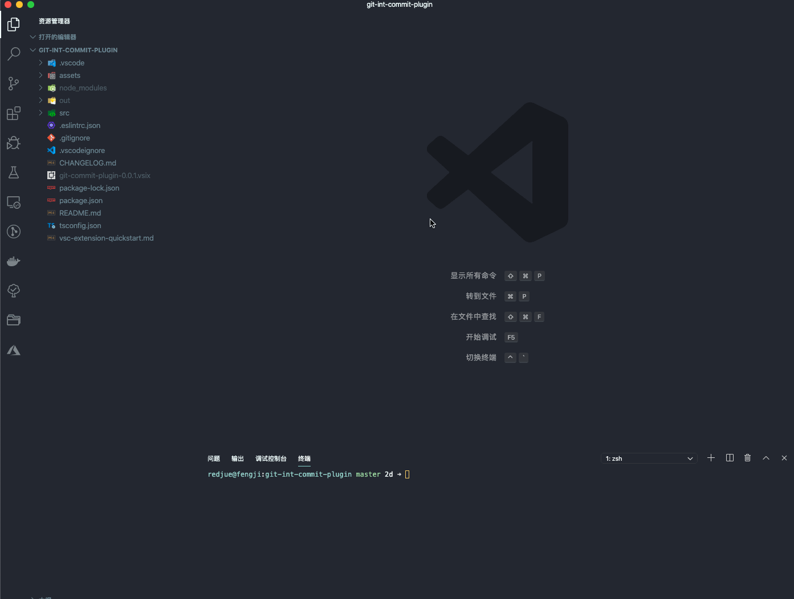
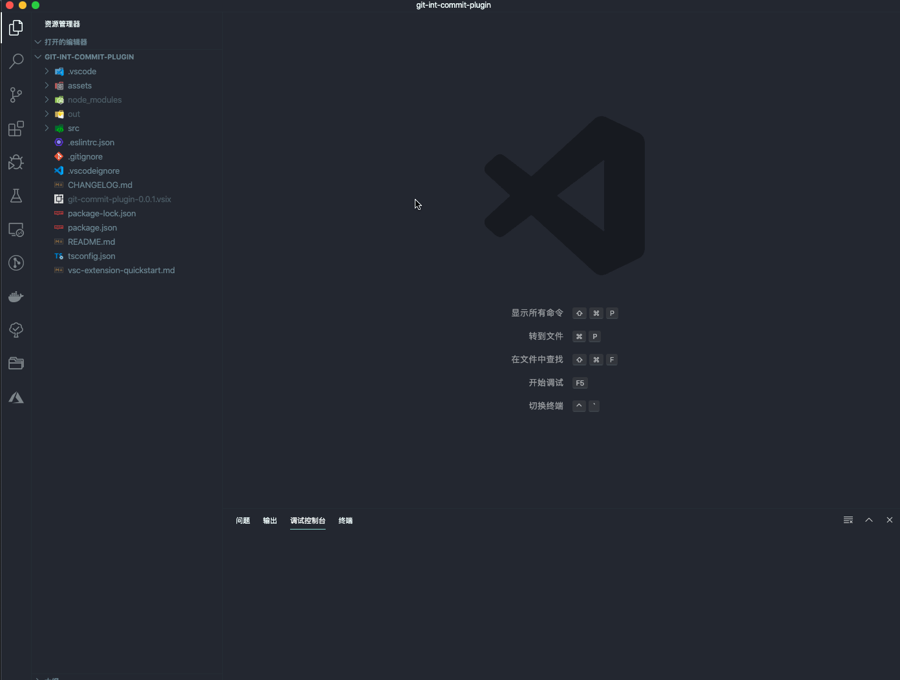

# Git-commit-plugin For Vscode


### Install above vscode (version >=1.42.0) and The git plugin needs to be installed.

### Follow the [Angular Team Commit Specification](https://github.com/angular/angular.js/blob/master/DEVELOPERS.md#-git-commit-guidelines),like the following:

```
<type>(<scope>): <subject>
<BLANK LINE>
<body>
<BLANK LINE>
<footer>
```

### Type

Must be one of the following:

-   **feat**: A new feature
-   **fix**: A bug fix
-   **docs**: Documentation only changes
-   **style**: Changes that do not affect the meaning of the code (white-space, formatting, missing semi-colons, etc)
-   **refactor**: A code change that neither fixes a bug nor adds a feature
-   **perf**: A code change that improves performance
-   **test**: Adding missing or correcting existing tests
-   **chore**: Changes to the build process or auxiliary tools and libraries such as documentation generation

### Scope

The scope could be anything specifying place of the commit change. For example `$location`, `$browser`, `$compile`, `$rootScope`, `ngHref`, `ngClick`, `ngView`, etc...

You can use `*` when the change affects more than a single scope.

### Subject

The subject contains succinct description of the change:

-   use the imperative, present tense: "change" not "changed" nor "changes"
-   don't capitalize first letter
-   no dot (.) at the end

### Body

Just as in the **subject**, use the imperative, present tense: "change" not "changed" nor "changes". The body should include the motivation for the change and contrast this with previous behavior.

### Footer

The footer should contain any information about **Breaking Changes** and is also the place to [reference GitHub issues that this commit closes](https://help.github.com/articles/closing-issues-via-commit-messages/).

**Breaking Changes** should start with the word `BREAKING CHANGE:` with a space or two newlines. The rest of the commit message is then used for this.

A detailed explanation can be found in this [document](https://docs.google.com/document/d/1QrDFcIiPjSLDn3EL15IJygNPiHORgU1_OOAqWjiDU5Y/edit#).

## Quick start

-   **Step1** Install the plugin

-   **Step2** Use the command shortcut `showGitCommit` to open the command window or Click the icon on the git plugin navigation bar

    

-   **Step3** Enter the commit information, which automatically generates a commit message that conforms to the specification

    

## Settings Options

-   `GitCommitPlugin.ShowEmoji`: whether to show emoji, default `true`.

```json
"GitCommitPlugin.ShowEmoji": true
```

-   `GitCommitPlugin.CustomCommitType`: customize the commit type, default `null`.

```json
"GitCommitPlugin.CustomCommitType": [
    "customTypeName"
] or [
   {
       "label": "customTypeName",
       "detail": "customTypeDetail"
   }
]
```

-   `GitCommitPlugin.MaxSubjectWords`: customize the maximum number of words on the subject, default `20`.

```json
"GitCommitPlugin.MaxSubjectWords": 20
```


-   `GitCommitPlugin.Template`: customize the git commit template.

```json
"GitCommitPlugin.Templates": [
    {
    "templateName": "Angular",
    "templateContent": "<type>(<scope>):<space><subject><enter><body><enter><footer>"
    },
    {
        "templateName": "odinSam",
        "templateContent": "<type>:<space>[<scope>]<space><subject><enter><body><enter><footer>"
    }
]
```

## license

### MIT


